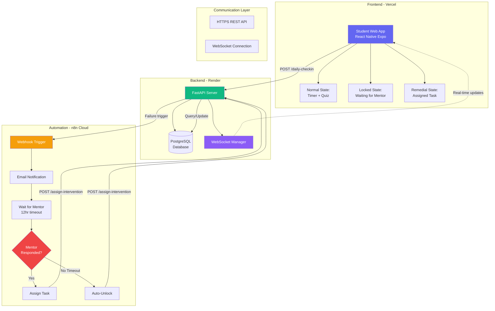
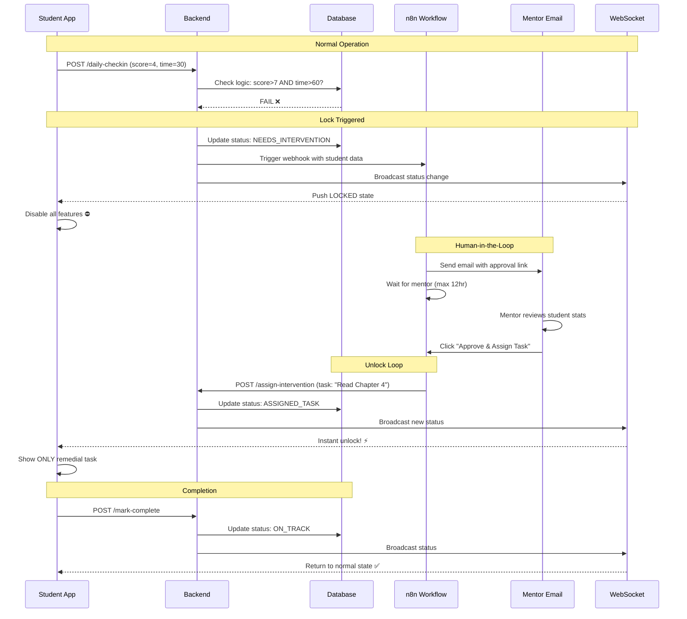

# 🎓 Intervention Engine

> **A Real-Time Student Intervention System with Automated Mentor Loop**  
> *Built for Alcovia Full Stack Engineering Intern Assignment*

[](https://intervention-engine.vercel.app/)
[](https://intervention-engine.onrender.com)
[](LICENSE)

An intelligent closed-loop system that automatically detects when students are falling behind and triggers a human-in-the-loop mentorship workflow, ensuring **no student gets left behind**.

---

## 🚀 Live Demo

- **🌐 Frontend**: [https://intervention-engine.vercel.app/](https://intervention-engine.vercel.app/)
- **⚡ Backend API**: [https://intervention-engine.onrender.com](https://intervention-engine.onrender.com)
- **📊 API Docs**: [https://intervention-engine.onrender.com/docs](https://intervention-engine.onrender.com/docs)
- **💚 Health Check**: [https://intervention-engine.onrender.com/health](https://intervention-engine.onrender.com/health)

### 🎥 Video Walkthrough

> **Loom Demo (5 min)**: [Watch the full Lock → Mentor → Unlock flow](YOUR_LOOM_LINK_HERE)

*Demonstrates: Bad score submission → App lockdown → n8n email trigger → Mentor approval → Instant WebSocket unlock*

---

## 📋 Table of Contents

- [Architecture Overview](#architecture-overview)
- [Core Features](#core-features)
- [System Flow](#system-flow)
- [Tech Stack](#tech-stack)
- [Database Schema](#database-schema)
- [API Endpoints](#api-endpoints)
- [Fail-Safe Mechanism](#fail-safe-mechanism)
- [Testing Guide](#testing-guide)
- [Setup & Deployment](#setup--deployment)
- [Assignment Compliance](#assignment-compliance)

---

## 🏗️ Architecture Overview

### System Architecture Diagram



### The Closed Loop



---

## ✨ Core Features

### 🎯 Assignment Requirements (100% Complete)

#### Problem 1: Backend State Management ✅
- **SQL Database**: PostgreSQL with `students`, `daily_logs`, `interventions` tables
- **Logic Gate**: `quiz_score > 7 AND focus_minutes > 60` determines success/failure
- **State Transitions**: `ON_TRACK` → `NEEDS_INTERVENTION` → `ASSIGNED_TASK`
- **n8n Integration**: Webhook trigger on student failure

#### Problem 2: Human-in-the-Loop Automation ✅
- **Email Notifications**: Automated mentor alerts with student performance data
- **Wait Mechanism**: Workflow pauses up to 12 hours for mentor approval
- **Callback Integration**: n8n calls `/assign-intervention` endpoint
- **Fail-Safe**: Auto-unlock with escalation email if mentor doesn't respond

#### Problem 3: Responsive Frontend ✅
- **Normal State**: Focus timer + daily quiz input
- **Locked State**: Complete lockdown with "Waiting for Mentor..." message
- **Remedial State**: Displays ONLY assigned task
- **Mark Complete**: Returns student to normal state

### 🎁 Bonus Features Implemented

#### ✅ Real-Time WebSockets (BONUS #2)
- **Instant Updates**: Student screen unlocks the moment mentor approves
- **No Polling**: WebSocket push notifications, zero refresh needed
- **Connection Status**: Visual indicator shows real-time connection state

#### ✅ Tab Switching Detection (BONUS #1)
- **Cheater Prevention**: Detects when student switches away during focus timer
- **Auto-Fail**: Session automatically fails if tab is hidden
- **Penalty Logging**: Violations recorded in database
- **Visual Feedback**: Warning message when student returns to tab

---

## 🔄 System Flow

### Complete Interaction Loop

**1. Student Daily Check-In**
```
Student submits performance:
  - Quiz Score: 4/10 (failing)
  - Focus Time: 30 minutes (insufficient)
  ↓
Backend evaluates: 4 > 7 AND 30 > 60? → FALSE
  ↓
Status updated: NEEDS_INTERVENTION
  ↓
App instantly locks via WebSocket ⛔
```

**2. Automated Mentor Notification**
```
Backend triggers n8n webhook →
  ↓
n8n sends email to mentor:
  - Student name & ID
  - Performance metrics
  - "Approve & Assign Task" button
  ↓
Workflow waits (max 12 hours)
```

**3. Mentor Intervention**
```
Mentor clicks approval link →
  ↓
n8n calls: POST /assign-intervention
  {
    "student_id": "...",
    "task": "Read Chapter 4"
  }
  ↓
Backend updates DB: ASSIGNED_TASK
  ↓
WebSocket broadcasts to student ⚡
  ↓
App unlocks INSTANTLY - shows only remedial task
```

**4. Task Completion**
```
Student clicks "Mark Complete" →
  ↓
Backend updates: ON_TRACK
  ↓
App returns to normal state ✅
```

---

## 🛠️ Tech Stack

| Layer | Technology | Purpose |
|-------|-----------|---------|
| **Frontend** | React Native (Expo Web) | Cross-platform web app |
| **Language** | TypeScript | Type-safe frontend code |
| **Styling** | React Native StyleSheet | Native mobile-like UI |
| **HTTP Client** | Axios | REST API communication |
| **Real-Time** | WebSocket (native) | Live status updates |
| **Deployment** | Vercel | Global CDN hosting |
| | | |
| **Backend** | FastAPI (Python 3.13) | High-performance async API |
| **Database** | PostgreSQL + asyncpg | SQL database with async driver |
| **ORM** | SQLAlchemy (async) | Type-safe database operations |
| **WebSockets** | Python WebSockets | Real-time bidirectional comm |
| **Deployment** | Render | Containerized backend hosting |
| | | |
| **Automation** | n8n (Cloud) | Visual workflow automation |
| **Notifications** | SMTP Email | Mentor alerts |
| **Wait Mechanism** | n8n Wait Node | Human-in-the-loop pausing |

---

## 🗄️ Database Schema

### Students
```sql
CREATE TABLE students (
    id UUID PRIMARY KEY,
    name VARCHAR(255) NOT NULL,
    status VARCHAR(50) NOT NULL CHECK (status IN ('ON_TRACK', 'NEEDS_INTERVENTION', 'ASSIGNED_TASK'))
);
```

### Daily Logs
```sql
CREATE TABLE daily_logs (
    id UUID PRIMARY KEY,
    student_id UUID REFERENCES students(id),
    quiz_score INTEGER NOT NULL CHECK (quiz_score >= 0 AND quiz_score <= 10),
    focus_minutes INTEGER NOT NULL CHECK (focus_minutes >= 0),
    result_status VARCHAR(50) NOT NULL CHECK (result_status IN ('SUCCESS', 'FAILURE')),
    logged_at TIMESTAMP DEFAULT NOW()
);
```

### Interventions
```sql
CREATE TABLE interventions (
    id UUID PRIMARY KEY,
    student_id UUID REFERENCES students(id),
    task VARCHAR(500) NOT NULL,
    assigned_by VARCHAR(100) NOT NULL,
    status VARCHAR(50) NOT NULL CHECK (status IN ('PENDING', 'COMPLETED')),
    assigned_at TIMESTAMP DEFAULT NOW(),
    completed_at TIMESTAMP
);
```

---

## 🔌 API Endpoints

### POST `/daily-checkin`

Submit daily performance metrics and trigger intervention logic.

**Request:**
```json
{
  "student_id": "11111111-1111-1111-1111-111111111111",
  "quiz_score": 4,
  "focus_minutes": 30
}
```

**Response (Success - score > 7 AND minutes > 60):**
```json
{
  "status": "On Track"
}
```

**Response (Failure - triggers n8n):**
```json
{
  "status": "Pending Mentor Review"
}
```

**Backend Logic:**
```python
is_success = quiz_score > 7 and focus_minutes > 60

if is_success:
    student.status = StudentStatus.ON_TRACK
else:
    student.status = StudentStatus.NEEDS_INTERVENTION
    # Trigger n8n webhook
    await httpx.post(n8n_webhook_url, json=student_data)
```

### POST `/assign-intervention`

Called by n8n when mentor approves or when timeout auto-unlocks.

**Request:**
```json
{
  "student_id": "11111111-1111-1111-1111-111111111111",
  "task": "Read Chapter 4"
}
```

**Special case - Auto-unlock:**
```json
{
  "student_id": "11111111-1111-1111-1111-111111111111",
  "task": "Auto-unlock"
}
```

### POST `/mark-complete`

Student marks assigned task as complete.

**Request:**
```json
{
  "student_id": "11111111-1111-1111-1111-111111111111"
}
```

**Result:**
- Sets intervention status to `COMPLETED`
- Updates student status to `ON_TRACK`
- Sends WebSocket update to student app

### GET `/student/{student_id}/status`

Retrieve current student state and pending task.

**Response:**
```json
{
  "student_id": "11111111-1111-1111-1111-111111111111",
  "status": "ASSIGNED_TASK",
  "current_task": "Read Chapter 4"
}
```

### WebSocket `/ws/{student_id}`

Real-time bidirectional connection for instant state updates.

**Events pushed to client:**
```json
{
  "event": "STATUS_CHANGED",
  "status": "ASSIGNED_TASK",
  "task": "Read Chapter 4",
  "message": "Mentor has assigned you a task"
}
```

---

## 🛡️ Fail-Safe Mechanism (Chaos Component)

### Problem Statement

> *"What happens if the Mentor doesn't reply for 12 hours? The student is locked out indefinitely."*

### Multi-Layer Solution

#### 1. **n8n Timeout (12 hours)**

The n8n "Wait For Mentor" node has a hard timeout:

```json
{
  "limitWaitTime": true,
  "resumeAmount": 12,  // hours
  "unit": "hours"
}
```

When timeout occurs:
- Workflow automatically continues to "Is Timed Out?" condition node
- Routes to "Backend Auto Unlock" instead of "Backend Assign Intervention"

#### 2. **Auto-Unlock Endpoint**

Backend recognizes special "Auto-unlock" task:

```python
if payload.task == "Auto-unlock":
    student.status = StudentStatus.ON_TRACK
    await db.commit()
    
    await websocket_manager.send_to_student(
        payload.student_id,
        {"event": "STATUS_CHANGED", "status": "ON_TRACK"}
    )
    
    return {"message": "Student auto-unlocked"}
```

#### 3. **Escalation Email**

When timeout occurs, n8n sends escalation email to admin/head mentor:

**Subject:** "⚠️ Mentor Unresponsive – Student Auto-Unlocked"

**Content:**
- Student details and failure metrics
- Notification that student was auto-unlocked
- Alert to review mentor responsiveness

### Future Enhancements

**Graduated Escalation:**
- 4 hours: Reminder to original mentor
- 8 hours: CC team lead
- 12 hours: Auto-unlock + escalate to head mentor

**Mentor Queue:**
- Route to backup mentor if primary doesn't respond within 2 hours
- Load balancing across mentor team

---

## 🧪 Testing Guide

### Test User Credentials

For testing purposes, a demo student has been pre-created in the database:

```
Student ID: 11111111-1111-1111-1111-111111111111
Student Name: Test Student
Initial Status: ON_TRACK
```

**This is hardcoded in the frontend** (`src/config.ts`) so you can immediately test the system without authentication.

### Test Scenarios

#### Scenario 1: Successful Check-In (Pass)
```
1. Start focus timer, run for 65+ seconds (simulates 65 minutes)
2. Enter quiz score: 8
3. Click "Submit Daily Check-In"
4. Expected: Status remains "On Track" ✅
```

#### Scenario 2: Failed Check-In (Lock Trigger)
```
1. Start focus timer, run for 20 seconds (simulates 20 minutes)
2. Enter quiz score: 4
3. Click "Submit Daily Check-In"
4. Expected: 
   - App instantly locks ⛔
   - Shows "Analysis in progress. Waiting for Mentor..."
   - Email sent to mentor
   - All inputs disabled
```

#### Scenario 3: Mentor Approval (Unlock)
```
1. (After Scenario 2) Check mentor email inbox
2. Click "Approve & Assign: Read Chapter 4" button
3. Expected:
   - App unlocks INSTANTLY (no refresh) ⚡
   - Shows only "Read Chapter 4" task
   - "Mark Complete" button visible
```

#### Scenario 4: Task Completion
```
1. (After Scenario 3) Click "Mark Complete"
2. Expected:
   - Returns to normal state
   - Timer and quiz inputs re-enabled
```

#### Scenario 5: Tab Switching Detection (Bonus)
```
1. Start focus timer
2. Switch to another tab/window
3. Wait 3 seconds
4. Return to app
5. Expected:
   - Timer stops automatically
   - Session marked as failed
   - Penalty logged
   - Warning message displayed
```

#### Scenario 6: Timeout Fail-Safe
```
1. Trigger lock (Scenario 2)
2. Do NOT click mentor email link
3. Wait 12 hours (or modify n8n timeout for faster testing)
4. Expected:
   - Student automatically unlocked
   - Escalation email sent to admin
```

### WebSocket Testing

**Check real-time connection:**
1. Open browser DevTools (F12) → Console
2. Look for: `"WebSocket connected successfully"`
3. Connection indicator should be **green ●**

**Test instant updates:**
1. Get student locked
2. Approve via mentor email in one tab
3. Watch student app in another tab
4. Should unlock INSTANTLY without refresh ⚡

---

## 🚀 Setup & Deployment

### Local Development

#### Backend
```bash
cd backend
pip install -r requirements.txt
cp .env.example .env
# Edit .env with your database URL and n8n webhook
uvicorn main:app --reload
```

#### Frontend
```bash
cd frontend
npm install
cp .env.example .env
# Edit .env or src/config.ts with backend URLs
npm run web
```

#### n8n Workflow
```
1. Go to your n8n instance (cloud or self-hosted)
2. Import: n8n_workflow/Student Intervention and Mentor Approval System.json
3. Configure SMTP credentials
4. Activate workflow
5. Copy webhook URL to backend .env
```

### Deployment

**Frontend (Vercel):**
```bash
cd frontend
npm run build:web
vercel deploy --prod
```

**Backend (Render):**
- Connected to GitHub repository
- Auto-deploys on push to main
- Environment variables configured in Render dashboard

See [`DEPLOYMENT.md`](./DEPLOYMENT.md) for detailed instructions.

---

## ✅ Assignment Compliance

### Recruiter Focus

> *"We are primarily testing the architecture, specifically ensuring the **Lock → Mentor Action → Unlock loop** works seamlessly. Please focus on getting the state management right."*

### ✅ State Management Verification

| State | Trigger | Database Status | App Behavior | Verified |
|-------|---------|-----------------|--------------|----------|
| **Normal** | score > 7 AND minutes > 60 | `ON_TRACK` | Full access to timer & quiz | ✅ |
| **Locked** | score ≤ 7 OR minutes ≤ 60 | `NEEDS_INTERVENTION` | All features disabled | ✅ |
| **Remedial** | Mentor assigns task | `ASSIGNED_TASK` | Shows ONLY task | ✅ |
| **Unlocked** | Task completed | `ON_TRACK` | Returns to normal | ✅ |

**Critical Loop Tested:**
```
Bad Score → DB: NEEDS_INTERVENTION → n8n Trigger → 
Email Sent → Mentor Clicks → DB: ASSIGNED_TASK →
WebSocket Push → App Unlocks Instantly ⚡
```

### Problem-by-Problem Checklist

#### Problem 1: Backend ✅
- [x] PostgreSQL database
- [x] Students, Daily_Logs, Interventions tables
- [x] POST /daily-checkin endpoint
- [x] Logic: score > 7 AND minutes > 60
- [x] Triggers n8n on failure
- [x] Returns correct status messages

#### Problem 2: n8n Automation ✅
- [x] Webhook trigger
- [x] Email notification to mentor
- [x] Wait node (12-hour timeout)
- [x] Mentor approval link
- [x] Calls /assign-intervention
- [x] Auto-unlock on timeout

#### Problem 3: Frontend ✅
- [x] React Native (Expo Web)
- [x] Deployed to Vercel
- [x] Normal state with timer & quiz
- [x] Locked state (disabled features)
- [x] Remedial state (task only)
- [x] Mark complete button

#### Chaos Component ✅
- [x] Fail-safe documented
- [x] 12-hour timeout implemented
- [x] Auto-unlock logic working
- [x] Escalation email configured

#### Bonus Challenges ✅
- [x] **WebSockets**: Instant unlock without refresh
- [x] **Tab Switching**: Auto-fail on tab change

---

## 📊 Project Structure

```
Intervention-Engine/
├── backend/
│   ├── main.py                 # FastAPI application + all endpoints
│   ├── models.py               # SQLAlchemy database models
│   ├── schemas.py              # Pydantic request/response schemas
│   ├── db.py                   # Database connection & session management
│   ├── config.py               # Environment variables & settings
│   ├── websocket_manager.py    # WebSocket connection handling
│   ├── requirements.txt        # Python dependencies
│   └── .env.example            # Environment variable template
├── frontend/
│   ├── src/
│   │   ├── screens/
│   │   │   └── FocusScreen.tsx      # Main app interface
│   │   ├── components/
│   │   │   ├── FocusTimer.tsx       # Timer with tab detection
│   │   │   ├── QuizInput.tsx        # Quiz score input
│   │   │   ├── LockedView.tsx       # Locked state UI
│   │   │   ├── RemedialView.tsx     # Task display UI
│   │   │   └── StatusBanner.tsx     # Status indicator
│   │   ├── hooks/
│   │   │   └── useStudentState.tsx  # WebSocket state hook
│   │   ├── api/
│   │   │   └── client.ts            # HTTP API functions
│   │   └── config.ts                # Backend URLs & constants
│   ├── App.tsx                      # Root component
│   ├── package.json
│   └── .env.example
├── n8n_workflow/
│   └── Student Intervention and Mentor Approval System.json
├── README.md                    # This file
├── DEPLOYMENT.md                # Deployment guide
└── .gitignore
```

---

## 🤝 Contributors

Built by **Nehil Chandrkar** for Alcovia Full Stack Engineering Intern Assignment

- **Email**: nehil.contact@gmail.com
- **GitHub**: [@NEhIL06](https://github.com/NEhIL06)
- **Repository**: [NEhIL06/Intervention-Engine](https://github.com/NEhIL06/Intervention-Engine)

---

## 📄 License

MIT License - See LICENSE file for details

---

## 🆘 Support

For issues or questions:
- **GitHub Issues**: [Create an issue](https://github.com/NEhIL06/Intervention-Engine/issues)
- **Email**: nehil.contact@gmail.com

---

## 🎯 Key Highlights

- ⚡ **Zero-Latency Updates**: WebSocket-powered instant state changes
- 🛡️ **Fail-Safe Architecture**: 12-hour timeout prevents indefinite lockout
- 🔒 **Integrity Checks**: Tab switching detection prevents cheating
- 📧 **Automated Workflows**: n8n handles complex human-in-the-loop logic
- 🚀 **Production Ready**: Deployed on Vercel + Render with full monitoring

---

**Built with ❤️ for Alcovia - Where every student matters.**
